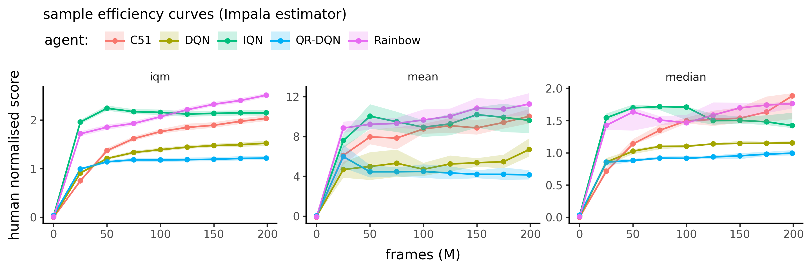
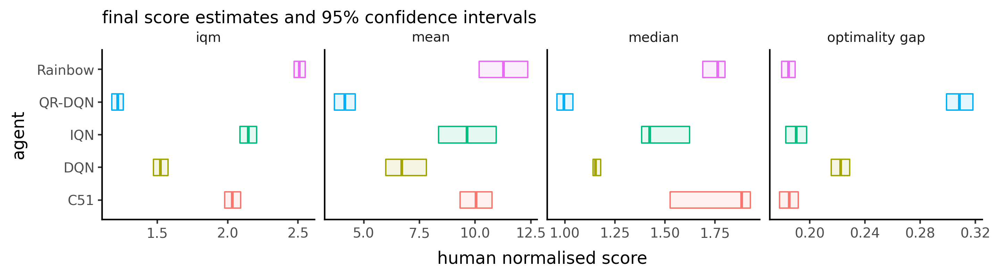
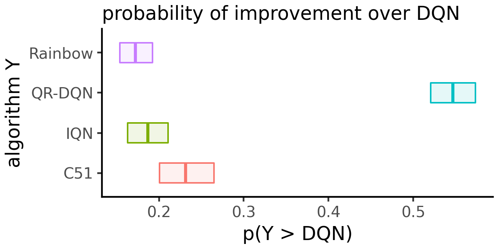
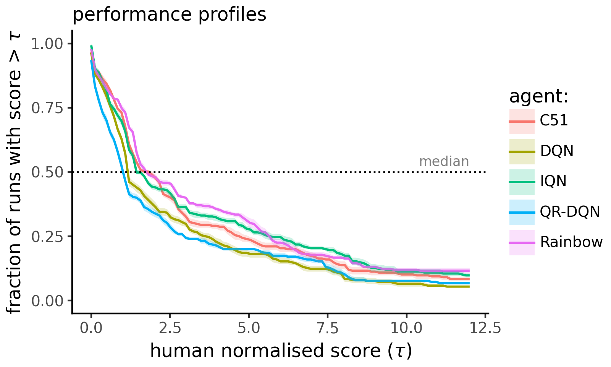

<p align="center"></p>

# beaRLy

Unofficial, unsanctioned and unholy implementation of [rliable](https://github.com/google-research/rliable) for `pandas` tabular data.

## motivation

`rliable` has long been one of my favorite selection of statistical tools for evaluating RL algorithms and noisy deep learning methods in general.

However, since I am using `pandas` a lot, I found it a bit tiresome to switch between pandas and the array-based API of `rliable` so I reimplemented some of the methods with `pandas`-first in mind.

Furthermore, the core library only depends on `numpy` and two methods from `scipy`.

**Disclaimer:** This is still work in progress, bugs are expected. The reference implementation should remain [rliable](https://github.com/google-research/rliable)!


## installation

```bash
# Core only
uv pip install git+https://github.com/floringogianu/bearly.git

# Core plus the popular plotting stack
uv pip install git+https://github.com/floringogianu/bearly.git#[plots]

# Core + plots + development tools
uv pip install git+https://github.com/floringogianu/bearly.git#[dev]
```

## functionality (so far)

| Function | Purpose |
|----------|---------|
| `get_interval_estimates` | Bootstrap‑based confidence intervals using stratified sampling with replacement |
| `get_paired_interval_estimates` | Estimate the probability that one algorithm beats another |
| `performance_profile` | The fraction of tasks that reach performance τ or higher for a range of tau values |

Metrics:

| Function | Purpose |
|----------|---------|
| `iqm` | Inter‑quartile mean (robust average) |
| `mean` | Average of task averages |
| `median` | Median of task averages |
| `iqm` | Inter‑quartile mean (robust average) |
| `optimality_gap` | Quantify how far a set of scores is from the ceiling |

### missing:
- [ ] bootstrapping over tasks and runs
- [ ] ranking plots


## show me the code!

For complete examples, check the `marimo` [notebook](p9_demo.py) included with the repo.

```python
import bearly
import pandas as pd

# load experiments (columns: step, agent, game, trial, (normalised) score)
df = pd.read_csv("./some_data.csv")

# confidence intervals for IQM
ci = bearly.get_interval_estimates(
    df,
    ("iqm", bearly.iqm),
    metric_col="score",
    task_col="game",
    group_cols=["agent", "step"],
    n_samples=2_000,
)
```

Will return a DataFrame containing confidence intervals for each agent, at every step.

With it you can then plot **sample efficiency curves**:



*Shows how the mean human normalised score (HNS) of each agent evolves over training steps. 95% confidence intervals shows the sensitivity of the aggregate if we were to use a larger number of trials per task (training runs per game).*

---

```python
# get the final scores
ci_final = ci.groupby(["agent", "stat_fn"]).tail(1)
```

With it we can then plot **final score estimates**:



*Cross‑bar plot of final HNS estimates for each agent, with 95 % confidence intervals.*

---

We can also compute the **probability of improvement** over some baseline:

```python
# get the final scores
df_final = df.groupby(["agent", "game", "trial"]).tail(1).reset_index()

# probability that Rainbow beats DQN on final step
p_rainbow_vs_dqn = bearly.get_paired_interval_estimates(
    df_final,
    compared=("agent", "Rainbow", "DQN"),
    task_col="game",
    metric_col="hns",
    n_samples=2_000,
)
```



*Cross‑bar visualisation of the probability that one algorithm outperforms another on aggregate. The y‑axis shows the estimated probability (`p(Y > X)`), while the bars encode the 95 % confidence interval around this estimate.*


---

Performance profiles:

```python
pp = brly.get_performance_profiles(
    cnn_final,
    tau_values=np.linspace(0, 12, 101),
    metric_col="hns",
    task_col="rom",
    group_cols=["agent"],
)
```



*Performance profiles allows for visualizing the fraction of tasks for which an algorithm achieves a normalized score at least equal to a threshold τ. This provides a comprehensive view of algorithm performance across the entire range of possible scores, capturing both the average performance and the robustness of an algorithm across tasks.*


### supervised learning

`beaRLy` is not restricted to evaluating RL algorithms! Whenever you have a fairly stochastic algorithm you want to evaluate in aggregate over a distribution of tasks, you can use the same tools: 

```python

# load results (columns: epoch, model, dataset, trial, val_acc)
df = pd.read_csv("not_rl_results.csv")

ci = bearly.get_interval_estimates(
    df,
    ("median", bearly.median),
    metric_col="val_acc",
    task_col="dataset",
    group_cols=["model", "epoch"],
    n_samples=2_000,
)

# probability that ResNet beats LeNet on the last epoch
df_final = df.groupby(["model", "dataset", "trial"]).tail(1).reset_index()
p_resnet_vs_lenet = bearly.get_paired_interval_estimates(
    df_final,
    compared=("model", "ResNet", "LeNet"),
    task_col="dataset",
    metric_col="val_acc",
    n_samples=2_000,
)
```

## credits
- [rliable](https://github.com/google-research/rliable) – original statistical framework for RL evaluation.
- [plotnine](https://github.com/has2k1/plotnine) – ggplot‑style charting for Python.
- [marimo](https://github.com/marimo-team/marimo) – interactive notebook framework.
- Python ecosystem (pandas, numpy, scipy) – essential data‑science stack.
